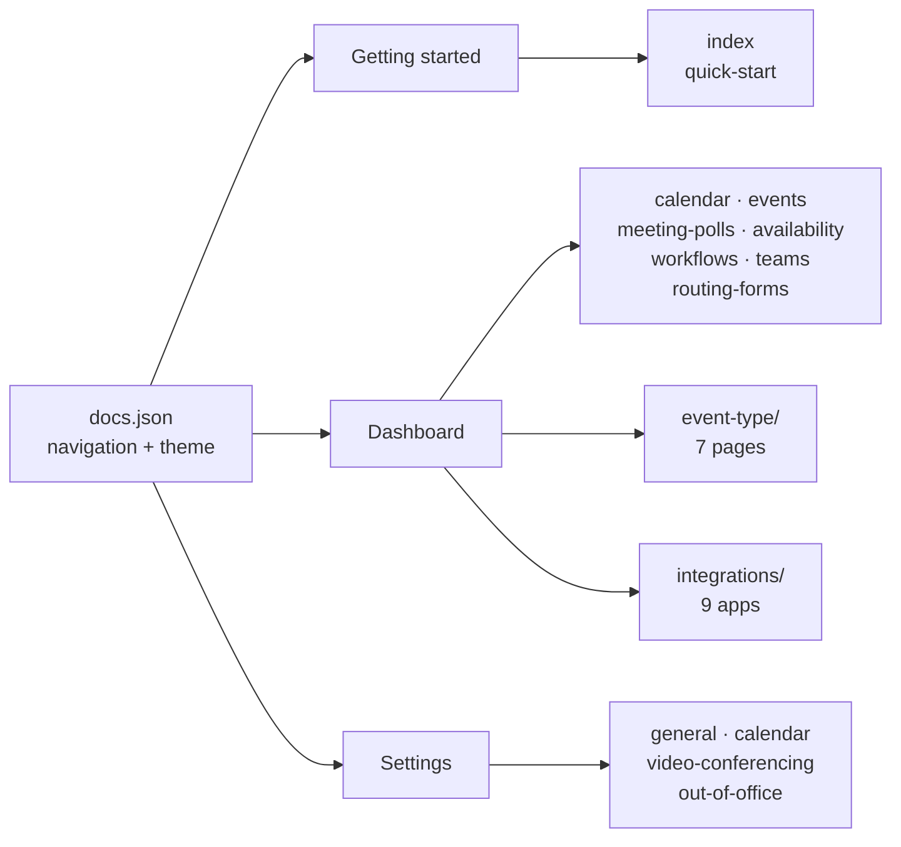

<picture>
  <source media="(prefers-color-scheme: dark)" srcset="https://shieldcn.dev/header/graph.svg?title=Novacal+Help+Center&subtitle=Documentation+for+Novacal+scheduling&align=left&mode=dark" />
  
</picture>

[](https://help.novacal.io)
[](docs.json)
[](https://github.com/ste7/events-help/commits/main)
[](LICENSE)

The content source for **[help.novacal.io](https://help.novacal.io)** — the user-facing documentation for [Novacal](https://novacal.io), scheduling software for booking meetings without the back-and-forth.

This repository holds no product code and has no build step. Every page is an MDX file, and [Mintlify](https://mintlify.com/docs) turns the folder into a hosted site on every push to `main`.

---

## Who this is for

| You are                            | Start here                                                                    |
| ---------------------------------- | ----------------------------------------------------------------------------- |
| A Novacal user looking for help    | [help.novacal.io](https://help.novacal.io) — this repo is just the raw source |
| Fixing a typo or clarifying a step | [Editing a page](#editing-a-page)                                             |
| Documenting a new feature          | [Adding a page](#adding-a-page)                                               |
| Changing structure, theme, or SEO  | [docs.json](docs.json) — see [Configuration](#configuration)                  |

---

## Quick start

Mintlify's CLI is the only dependency. There is no `package.json` here — install it globally.

```bash
npm i -g mint     # install the CLI
mint dev          # run from the repo root, where docs.json lives
```

Open <http://localhost:3000>. The preview hot-reloads as you save.

```bash
mint update            # upgrade the CLI when dev won't start
mint broken-links      # check every internal link before you push
mint a11y              # check pages for accessibility issues
mint rename old new    # rename a page and rewrite every link to it
```

---

## How the docs are organised



Page counts, by folder:

| Folder          | Files  | In navigation | Notes                                                                 |
| --------------- | ------ | ------------- | --------------------------------------------------------------------- |
| root            | 9      | 9             | Home, quick start, and the main dashboard pages                       |
| `event-type/`   | 7      | 7             | Basic, availability, limits, booking form, notifications, preferences |
| `integrations/` | 10     | 9             | `paypal.mdx` is written but unpublished                               |
| `settings/`     | 5      | 4             | `custom-domain.mdx` is written but unpublished                        |
| `essentials/`   | 5      | 0             | Mintlify starter examples, kept for syntax reference                  |
| `snippets/`     | 1      | 0             | Starter boilerplate, currently unused                                 |
| **Total**       | **37** | **29**        |                                                                       |

Supporting files:

```txt
docs.json      Navigation, theme, redirects, and all SEO metadata
custom.css     Hides the "Powered by Mintlify" footer link
umami.js       Umami + Ahrefs analytics loaders
images/        Screenshots, referenced from the site root as /images/*.png
logo/          light.svg and dark.svg wordmarks
```

---

## Editing a page

Every page opens with frontmatter. Match the house style — here is `settings/custom-domain.mdx`, unedited:

```mdx
---
title: "Custom Domain"
description: Use your own domain for your scheduling page. Add a custom domain, configure DNS, and manage domain status.
icon: "globe"
"og:title": "Custom Domain Settings - Novacal Help Center"
"og:description": "Set up a custom domain for your Novacal scheduling page. Add your domain, configure DNS, and manage verification."
"twitter:title": "Custom Domain Settings - Novacal Help Center"
"twitter:description": "Set up a custom domain for your Novacal scheduling page. Add your domain, configure DNS, and manage verification."
---
```

The conventions every page follows:

- **`title`** sets both the sidebar label and the page H1. Never write your own `#` heading — the body starts at `##`.
- **`description`** is the meta description. One sentence, plain, front-loaded with the feature name.
- **`og:` and `twitter:` titles** end with `- Novacal Help Center`. The two descriptions are usually identical to each other.
- **`icon`** is optional. It uses [Lucide](https://lucide.dev) names and only appears on a handful of top-level pages.

### Components

Callouts carry most of the emphasis. Current usage across the docs: `<Warning>` ×8, `<Note>` ×6, `<Info>` ×6, `<Tip>` ×2, `<Card>` ×1.

```mdx
<Warning>
  Deleting an event type also cancels every upcoming booking made through it.
</Warning>
```

Images sit at the site root and are written as plain `` — no wrapper, always with alt text. From `event-type/index.mdx`:

```mdx

```

The full component set is in the [Mintlify docs](https://mintlify.com/docs/components/accordions).

---

## Adding a page

A new `.mdx` file is invisible until it is listed in `docs.json`. Create the file, then add its path — no extension — to the right group under `navigation.groups`:

```json
{
  "group": "Settings",
  "pages": [
    "settings/general",
    "settings/calendar",
    "settings/video-conferencing",
    "settings/out-of-office",
    "settings/your-new-page"
  ]
}
```

Order in the array is the order in the sidebar. Nested groups take an `icon` and an `expanded` flag, as `event-type` and `integrations` do.

---

## Renaming or removing a page

The filename **is** the public URL, so renaming one breaks every inbound link and search result pointing at it.

Use the CLI rather than `git mv` — it rewrites internal references for you:

```bash
mint rename settings/general settings/account
```

That fixes links inside the docs. It does not fix links from outside, so add a redirect in the same commit:

```json
"redirects": [
  { "source": "/quickstart", "destination": "/quick-start" },
  { "source": "/event-type/confirmation", "destination": "/event-type/preferences" }
]
```

Both entries above are live — they are why the original URLs still resolve.

---

## Configuration

Everything site-wide lives in [docs.json](docs.json).

| Key                 | What it controls                                                                               |
| ------------------- | ---------------------------------------------------------------------------------------------- |
| `navigation.groups` | Sidebar structure. A page not listed here is not published.                                    |
| `redirects`         | Permanent redirects for moved or renamed pages.                                                |
| `colors`            | Brand colour, `#151312` across light, dark, and primary.                                       |
| `appearance`        | `default: "light"` with `strict: true` — the theme toggle is off and the site is always light. |
| `seo.metatags`      | Site-wide Open Graph, Twitter Card, and robots tags. Page frontmatter overrides these.         |
| `navbar`            | The Support mail link and the Dashboard button.                                                |
| `styling.customCss` | Loads [custom.css](custom.css).                                                                |

### Analytics

[umami.js](umami.js) defines loaders for Umami (`cloud.umami.is`) and Ahrefs. Nothing in `docs.json` references this file, so the tags that actually run in production are configured in the Mintlify dashboard — treat the file as a record of what is tracked, not as the thing doing the tracking.

---

## Publishing

Push to `main` and the [Mintlify GitHub app](https://dashboard.mintlify.com/settings/organization/github-app) deploys to [help.novacal.io](https://help.novacal.io) automatically. There is no CI in this repo and no manual build — `mint dev` locally is the only check before merge.

---

## Contributing

1. Branch off `main`.
2. Write or edit the `.mdx` file, matching the frontmatter pattern above.
3. Add the page to `docs.json` if it is new; add a redirect if you renamed one.
4. Run `mint dev` and read the page in the browser — MDX fails quietly, and a bad tag can swallow a whole section.
5. Run `mint broken-links`.
6. Open a PR. Merging to `main` publishes it.

**House style:** short sentences, second person, present tense. Say what the button does, not what the user might want to achieve. Screenshots go in `images/` as PNG, named after the feature (`create-et.png`, `notification-before.png`).

---

## Known cleanup

Small things a contributor will trip over, recorded so they don't get rediscovered:

- **`logo/light.svg` and `logo/dark.svg` are byte-identical**, both drawn in near-black `#1C1917`. The dark-mode logo would be invisible on a dark background. It goes unnoticed because `appearance.strict` pins the site to light mode.
- **`routing-forms/` is an empty directory** — a local leftover, untracked by git. The live page is `routing-forms.mdx` in the root.
- **`essentials/` and `snippets/`** are unmodified Mintlify starter-kit content. Useful as syntax reference, but they are not Novacal documentation.
- **`integrations/paypal.mdx` and `settings/custom-domain.mdx`** are complete pages that were never added to the navigation. Publishing either is a one-line change in `docs.json`.
- **[LICENSE](LICENSE) still reads `Copyright (c) 2023 Mintlify`**, inherited from the starter template. If the documentation content is meant to be Novacal's, update the copyright line.

---

## Maintainer

Written and maintained by **Stefan Babic** ([@ste7](https://github.com/ste7)) — 72 commits since September 2025.

Questions about the product go to [support@novacal.io](mailto:support@novacal.io). Product updates are posted on [LinkedIn](https://www.linkedin.com/company/novacal-io).

---

## Links

- **Docs** — <https://help.novacal.io>
- **Product** — <https://novacal.io>
- **Dashboard** — <https://app.novacal.io>
- **Support** — <support@novacal.io>

## License

[MIT](LICENSE).
